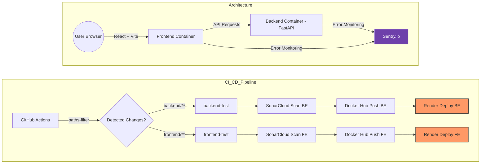

# 🚀 DevOps Playground: Fullstack CI/CD Case Study


[](https://sonarcloud.io/summary/new_code?id=Zhuravka-AI_devops-playground)
[](https://sonarcloud.io/summary/new_code?id=Zhuravka-AI_devops-playground)

This project is a live demonstration of a modern **Software Development Life Cycle (SDLC)**. It features a Monorepo architecture with a FastAPI backend and React frontend, governed by a rigorous CI/CD pipeline.

---

## 🚀 Live Demo

* **Frontend (UI):** [https://project-frontend-latest-3oj0.onrender.com](https://project-frontend-latest-3oj0.onrender.com)
* **Backend (API Docs):** [https://project-backend-latest-jtvw.onrender.com/docs](https://project-backend-latest-jtvw.onrender.com/docs)

---

## 🛠 Technical Stack

* **Frontend:** React (Vite), Vitest, CSS3
* **Backend:** Python (FastAPI), Pytest, Docker
* **CI/CD:** GitHub Actions (Path-based filtering)
* **Analysis:** SonarCloud (Static Analysis & Coverage)
* **Monitoring:** Sentry (Real-time Error Tracking)
* **Hosting:** Render (Cloud PaaS)

---

## 🏗 System Architecture

The following diagram illustrates the interaction between services and the integrated monitoring layer:



---

## ⚙️ CI/CD Pipeline Logic

The pipeline is optimized for speed and resource efficiency:

* **Selective Execution:** Uses `dorny/paths-filter`. If you only change Frontend code, the Backend tests and deployment are skipped.
* **Automated Quality Gate:** Deployment to production (`main` branch) is blocked if SonarCloud detects security vulnerabilities or if test coverage drops below the threshold.
* **Dockerized Builds:** Both services are containerized to ensure "it works on my machine" consistency in the cloud.
* **Traceability:** Every deployment is linked to a specific GitHub SHA and linked to Issues/PRs for full transparency.

---

## 📊 Monitoring & Quality

Keep track of the project's health and performance through these live dashboards:

* **🌐 Live Demo:** [View Website](https://project-frontend-latest.onrender.com)
* **🔍 SonarCloud Dashboard:** [Code Analysis Report](https://sonarcloud.io/dashboard?id=YOUR_PROJECT_KEY)
* **🛠 Sentry.io:** [Error Tracking Dashboard](https://sentry.io/organizations/your-org/projects/your-project/)

---

## 📦 Local Development

### Prerequisites

* Docker & Docker Compose

### Fast Start

```bash
# Clone the repository
git clone [https://github.com/YOUR_USERNAME/YOUR_REPO.git](https://github.com/YOUR_USERNAME/YOUR_REPO.git)

# Start the entire stack
docker-compose up --build
```

* **Frontend:** [http://localhost:80](http://localhost:80)
* **Backend:** [http://localhost:8000](http://localhost:8000)

---

## 📝 Project Management

This project follows a strict **Branching Strategy**:

* **main** - Production-ready code.
* **develop** - Integration branch for features.
* **feature/#-name** - Individual tasks linked to GitHub Issues.

*Example: Pull Requests containing "Closes #12" will automatically link and close the corresponding task upon merge.*
